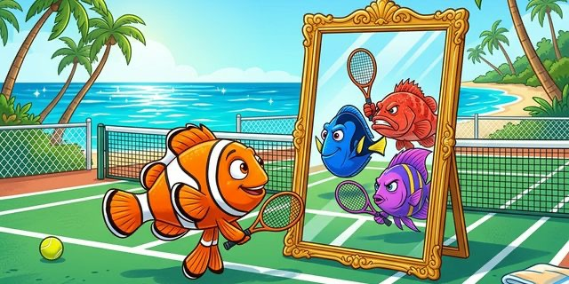
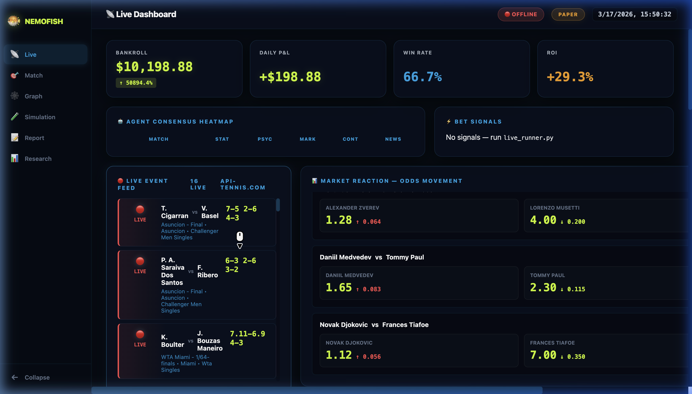
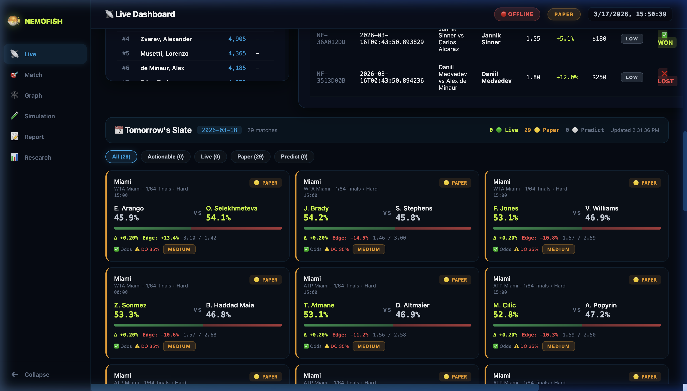

<div align="center">



### Swarm Intelligence Engine for Predictive Analytics

**Multi-agent reasoning · Consensus scoring · Autonomous execution**

[](https://github.com/ASGCompute/NemoFish/stargazers)
[](./LICENSE)
[](https://asgcompute.com)

[Quick Start](#-quick-start) · [How It Works](#-how-it-works) · [Dashboard](#-unified-control-room) · [Credits](#-credits)

</div>

---

## Overview

**NemoFish** is a swarm intelligence platform that coordinates multiple AI agents to generate probabilistic forecasts for competitive sports events. Each agent brings a different analytical lens — statistical modeling, psychological profiling, market signal analysis, scenario simulation — and they reach consensus through weighted voting. The system then scores opportunities by expected value and can execute positions on prediction markets autonomously.

This project began as a fork of [**MiroFish**](https://github.com/666ghj/MiroFish), an open-source multi-agent simulation engine developed by the CAMEL-AI research community. We extended MiroFish with a full-stack sports analytics pipeline and a unified control room for real-time monitoring.

> **An R&D project by [ASG Compute](https://asgcompute.com)** — exploring whether coordinated multi-agent reasoning can identify inefficiencies in prediction markets.

---

## 📊 Scale & Data Coverage

<div align="center">

| Metric | Value |
|:-------|------:|
| **Historical matches analyzed** | **971,320** |
| **Unique players profiled** | **33,962** |
| **Tournaments covered** | **9,201** |
| **Years of ATP data** | **1968 – 2026** (57 seasons) |
| **Surfaces modeled** | Hard · Clay · Grass · Carpet |
| **Live data feeds** | 4 providers (api-tennis, Sportradar, The Odds API, Polymarket) |
| **AI agents in swarm** | 6 specialized reasoning agents |
| **Features per match** | 47 (ELO, surface form, H2H, momentum, odds, news) |
| **Codebase** | 30,000+ lines across 160 modules |

</div>

The system ingests nearly **1 million historical matches** to build surface-weighted ELO ratings and train XGBoost probability models via walk-forward validation. At runtime, the 6-agent swarm overlays real-time signals (live odds movement, injury news, scheduling fatigue) on top of the statistical baseline to generate final consensus predictions.

---

## What We Built

| Layer | Description | Key Components |
|-------|-------------|----------------|
| **Data Ingestion** | Real-time feeds from 4+ providers | api-tennis.com, Sportradar, The Odds API, Polymarket |
| **Quantitative Models** | Surface-weighted ELO, XGBoost probability engine | Walk-forward validation, head-to-head analysis |
| **Agent Swarm** | 6 specialized reasoning agents | Statistical, Psychological, Market, Contrarian, News, MiroFish (LLM) |
| **Consensus Engine** | Weighted vote aggregation with edge scoring | Configurable thresholds, data quality gates |
| **Execution Pipeline** | Kelly criterion position sizing, risk management | Polymarket CLOB integration, PnL tracking |
| **Control Room** | Unified real-time dashboard | Live scores, odds movement, tomorrow's slate, trade journal |

---

## 📸 Unified Control Room

<div align="center">
<table>
<tr>
<td></td>
</tr>
<tr>
<td><em>KPIs, live event feed, odds movement tracking, agent consensus heatmap</em></td>
</tr>
<tr>
<td></td>
</tr>
<tr>
<td><em>Tomorrow's slate — win probabilities, edge calculations, and data quality scores per match</em></td>
</tr>
</table>
</div>

---

## 🏗 How It Works

```
  DATA FEEDS                         INTELLIGENCE                      OUTPUT
  ──────────                         ────────────                      ──────

  api-tennis.com ──┐
  sportradar     ──┤   ┌──────────────────────┐   ┌─────────────┐
  the-odds-api   ──┼──▶│   6-AGENT SWARM      │──▶│  CONSENSUS  │
  polymarket     ──┤   │                      │   │   ENGINE    │
  news feeds     ──┘   │  ELO · XGBoost       │   │             │
                       │  Psych · Market       │   │  Edge ≥ 3%? │
                       │  Contrarian · LLM     │   │  DQ check?  │
                       └──────────────────────┘   └──────┬──────┘
                                                         │
                                                         ▼
                                                  ┌─────────────┐
                                                  │  EXECUTION   │
                                                  │              │
                                                  │ Kelly sizing │
                                                  │ Risk limits  │
                                                  │ CLOB orders  │
                                                  └──────┬──────┘
                                                         │
                                                         ▼
                                                  ┌─────────────┐
                                                  │  DASHBOARD   │
                                                  │              │
                                                  │ Live scores  │
                                                  │ Odds tracker │
                                                  │ Trade journal│
                                                  └─────────────┘
```

**Pipeline flow:** Every cycle, the system ingests live data → builds a match dossier → runs each agent independently → aggregates into a consensus score → filters by minimum edge and data quality → sizes the position via fractional Kelly criterion → executes on prediction markets → tracks performance.

---

## 🧠 The Agent Swarm

Six agents analyze each match independently before voting:

| Agent | Analytical Focus | Data Sources |
|-------|-----------------|--------------|
| 📊 **Statistical** | Surface-weighted ELO, recent form, head-to-head record | Sackmann historical data, api-tennis |
| 🧠 **Psychological** | Momentum, pressure response, fatigue patterns | Recent match sequences, scheduling |
| 💹 **Market** | Line movement, sharp money indicators | The Odds API, Polymarket orderbook |
| 🔄 **Contrarian** | Public bias detection, mean reversion | Reverse market signals |
| 📰 **News** | Injury reports, fitness status, travel burden | RapidAPI news feed |
| 🐡 **MiroFish** | LLM scenario simulation, qualitative reasoning | DeepSeek V3.2 via NVIDIA NIM |

Agents vote independently. The consensus engine applies calibrated weights and only surfaces opportunities above configurable thresholds (default: ≥3% edge, ≥35% data quality).

---

## 🚀 Quick Start

### Prerequisites

| Tool | Version | Check |
|------|---------|-------|
| **Node.js** | 18+ | `node -v` |
| **Python** | ≥3.11 | `python --version` |
| **uv** | latest | `uv --version` |

### 1. Clone & Configure

```bash
git clone https://github.com/ASGCompute/NemoFish.git
cd NemoFish
cp .env.example .env
# Edit .env — add your API keys
```

### 2. Install

```bash
npm run setup:all
```

### 3. Run the Simulation Engine (MiroFish Core)

```bash
npm run dev
# Frontend → http://localhost:3000
# Backend  → http://localhost:5001
```

### 4. Run the Sports Prediction Terminal

```bash
# API server
cd terminal && python api/dashboard_server.py &

# Dashboard UI
cd terminal/dashboard && npm run dev
# Open http://localhost:5173

# Generate predictions for tomorrow's matches
python intelligence/slate_runner.py --dry-run
```

See [`.env.example`](./.env.example) for the full list of required API keys.

---

## 📁 Project Structure

```
NemoFish/
├── frontend/           # MiroFish simulation UI (Vue 3)
├── backend/            # MiroFish simulation engine (Python/CAMEL-AI)
├── terminal/           # Sports prediction terminal (our extension)
│   ├── agents/         # 6-agent swarm logic
│   ├── api/            # Dashboard REST API
│   ├── dashboard/      # Unified control room (React + Vite)
│   ├── execution/      # Position sizing & market execution
│   ├── feeds/          # Live data ingestion
│   ├── intelligence/   # Slate runner, scenario engine, dossier builder
│   ├── models/         # ELO engine, XGBoost classifiers
│   └── strategies/     # Kelly criterion, value confirmation
├── .env.example        # Environment variable template
└── docker-compose.yml  # Docker deployment
```

---

## ⚙️ Configuration

System parameters are defined in [`terminal/config.yaml`](./terminal/config.yaml):

```yaml
bankroll:
  initial_usd: 20
  kelly_fraction: 0.25      # Quarter Kelly (conservative)
  min_edge_percent: 3.0     # Minimum edge to act
  max_bet_percent: 5.0      # Maximum position size

swarm:
  tennis_agents: 6
  consensus_threshold: 0.08 # Minimum edge from agent consensus

execution:
  paper_trading: true       # Paper mode by default
```

---

## 🙏 Credits

**NemoFish** is built on top of [**MiroFish**](https://github.com/666ghj/MiroFish) by [@666ghj](https://github.com/666ghj), backed by [Shanda Group](https://www.shanda.com/). The core simulation engine is powered by [OASIS](https://github.com/camel-ai/oasis) from the CAMEL-AI research community.

We extended MiroFish with a quantitative sports analytics pipeline, a multi-agent prediction swarm, and a live execution layer with a unified control room. All credit for the original simulation framework goes to the MiroFish team.

---

## 📄 License

GPL-3.0 — consistent with the upstream MiroFish project. See [LICENSE](./LICENSE).

---

<div align="center">

**An [ASG Compute](https://asgcompute.com) Research Project**

*If you find this useful, give it a ⭐*

</div>
