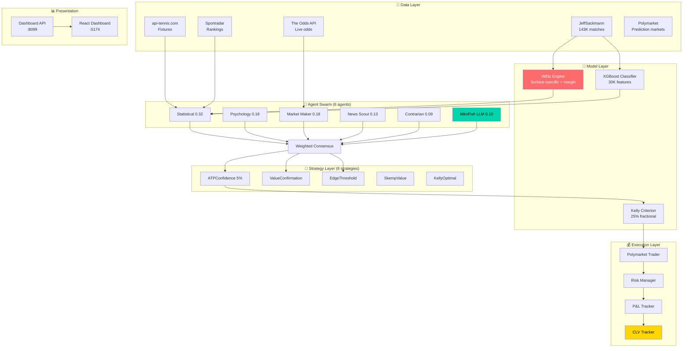
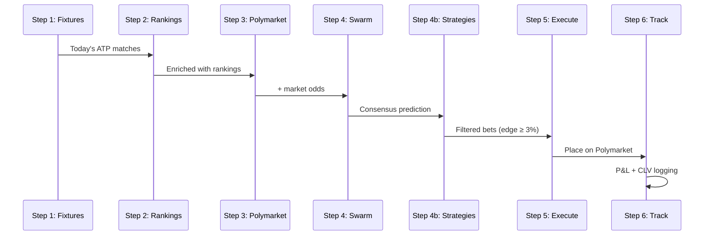

# 🐡 NemoFish — Full System Audit & Architecture

## Codebase Overview

| Layer | Tech | Files | LOC | Size |
|-------|------|-------|-----|------|
| **Terminal** (betting engine) | Python | 56 | 14,500 | — |
| **Backend** (MiroFish orig.) | Python/FastAPI | ~20 | ~5,000 | — |
| **Frontend** (MiroFish orig.) | Vue.js | 22 | 469 | — |
| **Dashboard** (NemoFish) | React/Vite/TS | 4 | ~1,200 | — |
| **Data** (Sackmann ATP) | CSV | 50+ | — | 1.4 GB |
| **Trained Model** | XGBoost pkl | 1 | — | 74 MB |

---

## Architecture

---

## Live Runner Pipeline

---

## 🔴 Critical Issues

### 1. No Tests (Severity: CRITICAL)
`terminal/tests/` is **empty**. Zero test coverage for the entire betting engine.

> [!CAUTION]
> A money-generating system with zero tests = guaranteed bugs in production. One wrong prediction sign flip → catastrophic losses.

**Action**: Write unit tests for `tennis_elo.py`, `strategy_base.py`, all strategies, and `clv_tracker.py`.

---

### 2. 74MB `.pkl` Model in Git (Severity: HIGH)
[tennis_gb.pkl](file:///Users/innocode/Desktop/Fish/terminal/models/tennis_gb.pkl) (74MB) is committed to git. This bloats the repo and makes cloning slow.

**Action**: Add `*.pkl` to `.gitignore`, use Git LFS or store in cloud.

---

### 3. Config.yaml Has Stale LLM References (Severity: MEDIUM)
[config.yaml](file:///Users/innocode/Desktop/Fish/terminal/config.yaml) says `llm_model: "deepseek-reasoner"` and `fallback_model: "qwen-2.5"` but actual `.env` uses `deepseek-v3.2` and `qwen3.5-32b`.

**Action**: Sync config.yaml with actual models.

---

### 4. NHL/Hockey Code Is Dead Code (Severity: LOW)
[nhl_api.py](file:///Users/innocode/Desktop/Fish/terminal/feeds/nhl_api.py) (8.5KB) and hockey XGBoost config in `config.yaml` are unused — the system only does tennis.

**Action**: Remove or move to `_archive/` to reduce confusion.

---

### 5. Dashboard Is Monolithic (Severity: MEDIUM)
[App.tsx](file:///Users/innocode/Desktop/Fish/terminal/dashboard/src/App.tsx) is **41KB in a single file**. Contains all tabs, charts, state management, styling.

**Action**: Split into components: `OverviewTab.tsx`, `StrategiesTab.tsx`, `PnLChartComponent.tsx`.

---

### 6. Backend (MiroFish) Is Disconnected (Severity: INFO)
The `backend/` folder is the original MiroFish simulation engine with Zep graph memory, OASIS profiles, and report agents. It has **no integration** with the NemoFish betting terminal.

**Action**: Either integrate (use report_agent for bet analysis) or clearly separate in README.

---

## 🟡 Moderate Issues

### 7. Walk-Forward Not Auto-Run
Walk-forward validator exists but hasn't been run on real data yet. No baseline ROI established.

### 8. Common-Opponent Features Missing
Planned in implementation_plan.md but not yet coded. Expected +1-2% ROI boost.

### 9. No Cron/Scheduler for Live Runner
`live_runner.py` is manual-run only. No `cron`, no `systemd`, no container orchestration.

### 10. Sackmann Data May Be Stale  
`refresh_sackmann.sh` exists but hasn't been scheduled. Data freshness depends on manual runs.

---

## 🟢 Positive Findings

| Area | Status |
|------|--------|
| Security (no leaked secrets) | ✅ |
| `.env` not tracked in git | ✅ |
| `.env.example` has no real keys | ✅ |
| 0 hardcoded API keys | ✅ |
| 0 TODO/FIXMEs in NemoFish code | ✅ |
| All NemoFish Python syntax valid | ✅ |
| WElo (Tier 1 research) implemented | ✅ |
| Fractional Kelly 25% | ✅ |
| CLV tracking | ✅ |
| MiroFish LLM integrated | ✅ |
| 6-agent swarm architecture | ✅ |
| 8 pluggable strategies | ✅ |
| Multi-strategy live runner | ✅ |
| The Odds API connected | ✅ |

---

## Priority Action Plan

| # | Action | Effort | Impact | Priority |
|---|--------|--------|--------|----------|
| 1 | **Write unit tests** for Elo, strategies, CLV | 🟡 4h | 🔴 Critical | **P0** |
| 2 | **Remove `.pkl` from git** → gitignore + LFS | 🟢 30m | 🟡 High | **P0** |
| 3 | **Run Walk-Forward** backtest → establish ROI baseline | 🟡 2h | 🔴 Critical | **P0** |
| 4 | **Add Common-Opponent** features to XGBoost | 🟡 4h | 🟡 +1-2% ROI | **P1** |
| 5 | Fix config.yaml stale refs | 🟢 10m | 🟢 Low | **P1** |
| 6 | Split dashboard into components | 🟡 2h | 🟡 Med | **P2** |
| 7 | Schedule `live_runner.py` via cron | 🟢 20m | 🟡 Med | **P1** |
| 8 | Schedule Sackmann refresh via cron | 🟢 10m | 🟢 Low | **P1** |
| 9 | Clean dead NHL code | 🟢 10m | 🟢 Low | **P3** |
| 10 | Document backend/terminal separation | 🟢 20m | 🟢 Low | **P3** |
