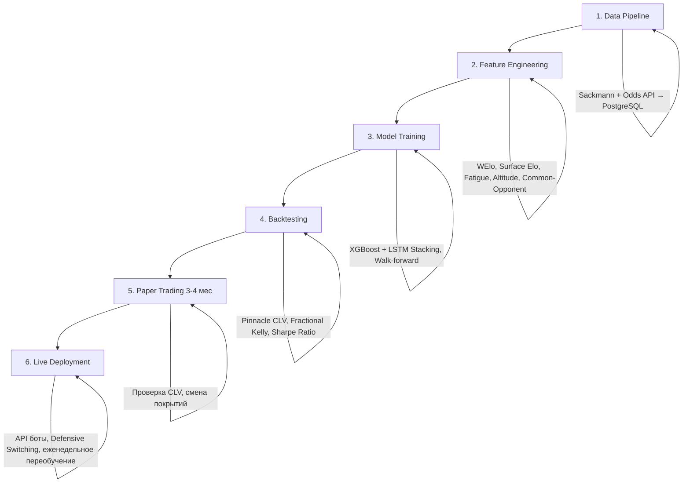

# 🎾 Что нам стоит добавить или улучшить в Fish

На основе глубокого исследования теннисных стратегий ставок — выводы и конкретные рекомендации.

---

## 📊 Ключевые выводы исследования

| Факт | Значение для нас |
|---|---|
| Реалистичный ROI = **2.5–5%** (не 20-70%) | Любые заявления выше 10% ROI на дистанции — красный флаг переобучения |
| **Линия закрытия Pinnacle** — лучший предиктор в мире | Если наша модель не бьёт CLV, она бесполезна |
| **WElo** > стандартный Elo | Нужно взвешивать маржу победы (счёт сетов/геймов) |
| **Surface-specific** рейтинги критичны | Единый рейтинг = потеря информации |
| **Walk-forward validation** — единственный честный метод | k-fold / random split = look-ahead bias |
| **Fractional Kelly (25%)** — стандарт отрасли | Полный Kelly → катастрофические просадки |
| Published strategies stop working | Нужна собственная edge, не копирование |

---

## 🔴 Что КРИТИЧЕСКИ нужно добавить

### 1. Weighted Elo (WElo) вместо стандартного Elo
> Tier 1 ✅ — ROI 3.56% (Angelini et al., 2022)

Текущий стандартный Elo не учитывает маржу победы. Победа 6-0, 6-0 = та же что 7-6, 7-6. **WElo** корректирует шаг обновления пропорционально доле выигранных сетов/геймов.

```
Рекомендация: Модифицировать расчёт Elo, добавив весовой
коэффициент = (sets_won / total_sets) * (games_won / total_games)
```

### 2. Surface-Specific рейтинги
> Используется во всех Tier 1 стратегиях

Вести **4 отдельных рейтинга** для каждого игрока:
- Hard court Elo
- Clay Elo
- Grass Elo
- Indoor Elo

Или: `Base_Elo + Surface_Advantage_coefficient`

### 3. Common-Opponent фильтр (фичи)
> Tier 1 ✅ — ROI 4.35% (Sipko, Imperial College)

Вместо абсолютных % подач → дифференциалы эффективности двух игроков **против одних и тех же оппонентов**. Снимает смещение из-за разной силы расписания.

### 4. Walk-Forward Validation
> **Обязательно** для любой честной оценки

Текущий бэктест (если использует random split) → заменить на скользящее окно:
- Train: 2012-2018 → Predict: неделя 1 2019
- Train: 2012-2018 + неделя 1 → Predict: неделя 2 2019
- И т.д.

### 5. CLV-трекинг (Closing Line Value)
> Единственная метрика, гарантирующая долгосрочную прибыль

Фиксировать момент размещения ставки и сравнивать с финальной линией закрытия Pinnacle. Если мы систематически бьём CLV → edge подтверждён.

---

## 🟡 Что ЖЕЛАТЕЛЬНО добавить

### 6. Индекс кумулятивной усталости
Считать **минуты на корте за последние 7/14 дней**. Особенно критично:
- Поздние раунды ТБШ (5 сетов)
- Быстрые смены турниров (< 48 часов)
- Длинные матчи > 3 часов накануне

### 7. Фактор высоты турнира
Турниры в Боготе, Кито — мяч летит быстрее, "сервботы" получают аномальное преимущество. Добавить `altitude_meters` как фичу.

### 8. Мотивация / "Танкинг" детектор
Выявлять ситуации:
- Топ-игрок на ATP 250 перед мейджором
- Игрок получает appearance fee (стартовый гонорар)
- Историческая статистика проигрышей в первых раундах

### 9. Glicko-2 параметр неопределённости
Для игроков после травм/пауз — рейтинг "размывается". Использовать Rating Deviation для снижения confidence в предсказаниях.

### 10. Stacking Ensemble
Архитектура мета-обучения:
```
Level 1: XGBoost (табличные фичи) + LSTM (временные ряды формы)
Level 2: Логистическая регрессия (метамодель) + коэффициенты Pinnacle
→ Итоговая калиброванная вероятность [0, 1]
```

---

## 🟢 Что стоит УЛУЧШИТЬ

### 11. Калибровка вероятностей
Если модель выдаёт P=0.60, проверить: **действительно ли в 60% таких случаев игрок побеждает**? Без точной калибровки Kelly Criterion будет губительным.

### 12. Дробный Kelly (Fractional Kelly)
Использовать **25% от полного Kelly** как размер ставки. Это снижает volatility в ~4 раза, сохраняя экспоненциальный рост.

### 13. Stop-Loss / Defensive Switching
- Если drawdown достигает **15%** → автоматическая пауза
- Если фактическая кривая отклоняется от бэктеста на **2σ вниз** → заморозка торговли

### 14. Paper Trading фаза
**3-4 месяца** виртуальных ставок перед live. Обязательно захватить смену покрытий (хард → грунт → трава). Ключевая метрика — систематический положительный CLV.

---

## ❌ Чего НЕ делать (анти-паттерны)

| Ловушка | Как избежать |
|---|---|
| Look-ahead bias | Строго Walk-forward, никогда random split |
| Survivorship bias | Включать ВСЕХ игроков, включая завершивших карьеру |
| Accuracy как метрика | Использовать ROI, CLV, Brier Score, а не % угаданных |
| Полный Kelly | Только Fractional (25%) |
| Ставки на все матчи | Только при edge ≥ 4-5% |
| Копирование открытых стратегий | Опубликованные edge быстро умирают |

---

## 📦 Практический Roadmap



---

## 📈 Приоритеты реализации

| # | Что делать | Сложность | Ожидаемый буст | Приоритет |
|---|---|---|---|---|
| 1 | WElo вместо Elo | 🟢 Низкая | +0.5-1% ROI | 🔴 **P0** |
| 2 | Surface-Specific Elo | 🟢 Низкая | +0.5-1% ROI | 🔴 **P0** |
| 3 | Walk-Forward Validation | 🟡 Средняя | Честная оценка edge | 🔴 **P0** |
| 4 | CLV трекинг | 🟡 Средняя | Гаранитя edge | 🔴 **P0** |
| 5 | Common-Opponent фильтр | 🟡 Средняя | +1-2% ROI | 🟡 **P1** |
| 6 | Индекс усталости | 🟢 Низкая | +0.3-0.5% ROI | 🟡 **P1** |
| 7 | Fractional Kelly 25% | 🟢 Низкая | ↓ Drawdown в 4x | 🟡 **P1** |
| 8 | Калибровка вероятностей | 🟡 Средняя | Корректный Kelly | 🟡 **P1** |
| 9 | Stacking Ensemble | 🔴 Высокая | +1-2% ROI | 🟢 **P2** |
| 10 | LSTM для формы | 🔴 Высокая | Скрытые тренды | 🟢 **P2** |
| 11 | Фактор высоты | 🟢 Низкая | Нишевый edge | 🟢 **P2** |
| 12 | Retirement Dutching | 🟡 Средняя | Безрисковая прибыль | 🟢 **P2** |
